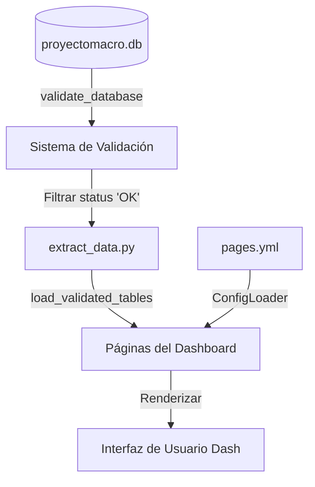

# Guía del Dashboard Macroeconómico de Bolivia

Este documento proporciona una explicación detallada del funcionamiento, arquitectura y flujo de datos del **Dashboard Macroeconómico de Bolivia**. Su propósito es servir como guía de referencia rápida para recordar el diseño del sistema, facilitar su mantenimiento e indicar cómo añadir nuevos indicadores.

---

## 1. Visión General y Ejecución

El dashboard es una aplicación web interactiva diseñada para visualizar, explorar y analizar datos macroeconómicos históricos de Bolivia (1950-2024). Está construido sobre el ecosistema **Python**, utilizando **Dash** (de Plotly) para la interfaz y callbacks reactivos, **Dash Bootstrap Components (DBC)** para el estilo visual y **SQLite** como base de datos local.

### Cómo Iniciar el Dashboard
Existen dos formas de ejecutar el dashboard localmente:

1. **Mediante el Launcher Automatizado (Recomendado):**
   Ejecuta el script de conveniencia en la raíz del proyecto. Este script activa el entorno virtual, configura la variable `PYTHONPATH` para resolver las rutas internas, inicia el servidor y abre automáticamente tu navegador web por defecto en la dirección de la app:
   ```bash
   python launch_dashboard.py
   ```
2. **Ejecución Directa:**
   Si prefieres ejecutarlo manualmente con tu entorno virtual activo:
   ```bash
   python run.py
   ```

* **URL por defecto:** `http://127.0.0.1:8050`
* **Contraseña de acceso:** `macro2024` (definida en `src/proyectomacro/app.py` en la variable `PASSWORD`).

---

## 2. Arquitectura de Archivos y Componentes

El código del dashboard está estructurado bajo el patrón de **Dash Multi-page** (`use_pages=True`), lo que permite que cada sección y tabla actúe como una página independiente con su propio archivo e importaciones, compartiendo una base común.

### Directorios y Archivos Clave

* **`src/proyectomacro/app.py`:** Punto de entrada y estructura principal. Define:
  * Inicialización de la app Dash y configuración de la carpeta de recursos estáticos (`assets/`).
  * Estructura general de navegación (Sidebar izquierdo con las secciones principales).
  * Pantalla de control de acceso (Login) con validación de contraseña.
  * Inyección dinámica de las páginas hijas utilizando `page_container`.
* **`src/proyectomacro/page_utils.py`:** Fábrica central de componentes visuales. Contiene funciones reutilizables que estandarizan el diseño y evitan la duplicación de código en las páginas (breadcrumbs, headers, paneles de metadatos, galerías de imágenes y la configuración global de estilos de tablas).
* **`src/proyectomacro/config_loader.py`:** Módulo encargado de leer y parsear la configuración de páginas y tablas desde el archivo centralizado YAML `pages.yml`.
* **`src/proyectomacro/extract_data.py`:** Lógica de extracción de datos de la base de datos SQLite. Filtra y carga únicamente tablas validadas como "OK" y mapea las rutas de los gráficos estáticos correspondientes.
* **`src/proyectomacro/config/`:**
  * **`pages.yml`:** Fuente de verdad del dashboard. Contiene la lista estructurada de secciones, rutas del menú, IDs de las tablas en la BD, etiquetas de visualización y sus respectivos metadatos (descripción, periodo, unidades, fuentes, notas).
  * **`tables_metadata.yml`:** Metadata detallada por columna (escala, tipo de dato, moneda y años base) utilizada principalmente por el generador de gráficas personalizado.
* **`src/proyectomacro/pages/`:** Contiene los archivos Python de las páginas del dashboard. Se divide en herramientas globales y subcarpetas para cada sector macroeconómico:
  * `inicio.py`: Pantalla de bienvenida con tarjetas de navegación a los sectores.
  * `calculadora.py`: Herramienta interactiva para análisis estadístico en tiempo real.
  * `plotter_matplotlib.py`: Interfaz para generar gráficas de serie completa a la medida.
  * Carpetas sectoriales (ej: `cuentas_nacionales/`, `deuda/`, `sector_externo/`, etc.): Albergan los scripts individuales para cada tabla específica (por ejemplo, `pib_ramas.py`).

---

## 3. Flujo de Datos e Integración con la Base de Datos

El almacenamiento de los datos históricos del dashboard está centralizado en un archivo local de SQLite.



### Acceso a Datos (`func_auxiliares.graficos_utils.get_df`)
Para garantizar la uniformidad en la preparación de datos y operaciones numéricas comunes, el proyecto utiliza la función `get_df`:
```python
from func_auxiliares.graficos_utils import get_df
from func_auxiliares.config import DB_PATH

df = get_df(
    sql="SELECT * FROM pib_ramas",
    conn_str=str(DB_PATH),
    index_col="año"
)
```
Esta función conecta a la base de datos SQLite, lee la consulta, indexa por el año, redondea de manera automática los valores numéricos a dos decimales y opcionalmente permite renombrar columnas, multiplicar por factores de escala o calcular sumatorias agregadas al vuelo.

### Validación Activa (`load_validated_tables`)
Antes de cargar los datos de las tablas macroeconómicas, el sistema corre un proceso de validación centralizado (`validate_all.py` usando `rules.yml`). El dashboard llama a `load_validated_tables()`, el cual:
1. Ejecuta la validación de integridad en la base de datos SQLite.
2. Identifica el estado de cada tabla.
3. Solo devuelve y expone en la interfaz aquellas tablas cuyo estado de validación sea marcado como `"OK"`.

---

## 4. Centralización de Metadatos y Estilos

El proyecto implementa un sistema centralizado para metadatos y estilos con el fin de mantener el código limpio (DRY - *Don't Repeat Yourself*).

### A. Metadatos Centralizados (`pages.yml`)
En lugar de definir títulos, unidades y fuentes directamente en el código de cada archivo, estos se describen en `src/proyectomacro/config/pages.yml`. 
La función `load_metadata_from_config(TABLE_ID)` en `page_utils.py` lee este archivo e inyecta la información en los paneles correspondientes. Esto permite realizar cambios en la documentación y fuentes del proyecto sin necesidad de modificar el código ejecutable de Python.

### B. Estilos de Tablas de Datos (`TABLE_STYLES_SYSTEM.md`)
Las tablas interactivas de Dash se estilizan mediante una configuración centralizada en `src/proyectomacro/page_utils.py`:
* **`DEFAULT_TABLE_STYLES`**: Define el tipo de letra (sans-serif), tamaño de fuente (14px), padding, bordes redondeados y sombreado para darle un aspecto moderno y limpio.
* **Estilos Condicionales**: Las filas impares tienen un fondo gris claro alternante (`#f9fafb`), la fila seleccionada se resalta en azul (`#e3f2fd`) y el índice de años se muestra con texto alineado a la izquierda y negrita (`fontWeight: "600"`).
* **`get_table_styles(custom_styles)`**: Función que devuelve los estilos base de tabla, permitiendo sobrescribir propiedades específicas (por ejemplo, cambiar el color del encabezado a verde en ciertas páginas) sin perder el resto del diseño.

---

## 5. Diseño Estándar de una Página de Indicador

Cada página individual asociada a una tabla macroeconómica (ej. `pib_ramas.py`) utiliza los mismos bloques de construcción visuales definidos en `page_utils.py`:

1. **Breadcrumb (`build_breadcrumb`):**
   Muestra la ruta de navegación (ej. `Inicio > Cuentas Nacionales > PIB por ramas`) y un badge (etiqueta) en la esquina superior derecha indicando el estado de validación de los datos (`✅ OK` o `⚠️ Revisar`).
2. **Encabezado y Panel de Metadatos (`build_header`):**
   Presenta el título descriptivo del indicador y un botón colapsable para "Mostrar detalles de la tabla". Al hacer clic, se despliega el panel de metadatos con:
   * Nombre descriptivo y rango de años disponible.
   * Unidades de medida detalladas por columna.
   * Lista de fuentes oficiales (con enlaces cliqueables si contienen URLs).
   * Notas metodológicas importantes.
3. **Galería de Gráficas de Tesis (`build_image_gallery_card`):**
   Para complementar las tablas interactivas, la tesis académica genera gráficas estáticas usando Matplotlib y las almacena en la carpeta de recursos. Esta card despliega esas imágenes divididas en pestañas (Tabs):
   * **Serie completa:** Gráficas a largo plazo que cubren todo el período histórico del indicador.
   * **Crisis:** Zoom a periodos específicos de recesión o shock económico boliviano.
   * Cada imagen tiene un botón de **Descarga** directa.
4. **Tabla de Datos Interactiva (`build_data_table`):**
   Muestra los datos en bruto con funcionalidades nativas del navegador:
   * Paginación de 10 en 10 filas para optimizar la velocidad.
   * Filtros en los encabezados de columna para buscar rangos o valores.
   * Ordenamiento ascendente/descendente (soporta ordenamiento de múltiples columnas mediante Shift+clic).
   * Botón para exportar y descargar el conjunto de datos filtrado en formato **CSV**.

---

## 6. Herramientas Especiales del Dashboard

Además de la consulta de datos estandarizada, el dashboard cuenta con dos módulos de análisis dinámico de alto nivel:

### 1. Calculadora Macroeconómica (`pages/calculadora.py`)
Diseñada para realizar transformaciones estadísticas rápidas sobre las series de tiempo directamente desde la interfaz web, sin requerir scripts manuales.

* **Filtros de Entrada:** Permite seleccionar cualquier tabla de la base de datos, elegir una variable numérica específica y acotar el rango de análisis mediante un slider de años interactivo.
* **Cálculos Disponibles:**
  * **Tasas de Crecimiento:** Permite calcular la variación porcentual año a año (Tasa Anual), tasas trimestrales o la tasa acumulada respecto al año base del rango seleccionado.
  * **Medias Estadísticas:** Calcula la Media Aritmética Simple, Media Móvil (con ventana de años configurable, ej. 3 o 5 años) o Media Ponderada por tiempo (donde los años más recientes tienen mayor relevancia).
* **Salida de Resultados:**
  * **Estadísticas de Resumen:** Tarjetas con el valor medio, desviación estándar, máximos y mínimos de la variable original y de la tasa de crecimiento calculada.
  * **Tabla Detallada:** Un componente `DataTable` con la serie temporal original alineada junto a las nuevas columnas de tasas y medias móviles calculadas.
  * **Visualización Dinámica (Plotly):** Genera en tiempo real un conjunto de subplots interactivos:
    1. Serie temporal original.
    2. Comportamiento de las Tasas de Crecimiento.
    3. Curva de la Media Móvil (si fue configurada).
    4. Histograma de distribución de frecuencias para analizar la volatilidad de las tasas.

### 2. Generador de Gráficas de Serie Completa (`pages/plotter_matplotlib.py`)
Permite a los investigadores generar gráficos estáticos con la misma calidad visual corporativa que las figuras de la tesis académica, pero con la flexibilidad de elegir las variables a graficar.

* **Selección Multivariable:** Permite seleccionar hasta un máximo de 5 variables numéricas simultáneas de una misma tabla.
* **Ajuste Temporal:** Lee el periodo disponible desde `pages.yml` y restringe el RangeSlider a los años válidos de la tabla seleccionada.
* **Personalización Básica:** Permite introducir un título personalizado para el gráfico.
* **Motor Matplotlib Remoto:**
  Al presionar "Generar Gráfica", el servidor de Dash ejecuta la función `init_base_plot` de `func_auxiliares.graficos_utils` aplicando el tema visual corporativo (`set_style()`), que usa fuentes Serif y colores de paleta específicos.
  Dado que es un servidor web, se usa el backend no interactivo `'Agg'` de Matplotlib. El gráfico generado en el servidor se convierte en un string binario codificado en **Base64** que se inyecta directamente en la etiqueta `html.Img` de la interfaz para su visualización y posterior descarga.

---

## 7. Flujo de Autenticación

El acceso al dashboard está protegido mediante una validación de contraseña.

1. **Estado Inicial:** Al cargar el sitio, la variable `dashboard_layout` tiene el estilo `display: "none"`, mostrándose únicamente la tarjeta de login.
2. **Validación:** El usuario ingresa la contraseña y hace clic en "Ingresar". El callback `validate_password` compara el texto con la constante `PASSWORD = "macro2024"`.
3. **Persistencia de Sesión:** Si la autenticación es correcta, se guarda el estado `{"authenticated": True}` en un componente `dcc.Store` con `storage_type="session"`. Esto evita que el usuario tenga que ingresar la contraseña de nuevo al refrescar el navegador en la pestaña activa.
4. **Transición Visual:** El callback `toggle_login_dashboard` reacciona a los cambios en el `dcc.Store`. Si detecta la bandera activa de autenticación, oculta el formulario de login e inicializa el panel de navegación principal con el sidebar y el contenedor de páginas.

---

## 8. Guía Práctica: Cómo Añadir un Nuevo Indicador al Dashboard

Para añadir un nuevo indicador o tabla al dashboard, sigue estos pasos estructurados:

### Paso 1: Importar los datos a la Base de Datos SQLite
Asegúrate de que la tabla esté creada en `db/proyectomacro.db`. La tabla debe tener como columna primaria o índice la columna `año` (de tipo `INTEGER`).

### Paso 2: Registrar en `pages.yml`
Edita el archivo `src/proyectomacro/config/pages.yml` e introduce el registro de la tabla bajo la sección correspondiente. Por ejemplo, en `sector_fiscal`:
```yaml
      mi_nuevo_indicador:
        tabla: "mi_tabla_en_sqlite"
        label: "Mi Nuevo Indicador Fiscal"
        metadata:
          nombre_descriptivo: "Descripción detallada del indicador fiscal"
          periodo: "1980 – 2024"
          unidad: "Millones de bolivianos"
          fuentes:
            - "Ministerio de Economía y Finanzas Públicas"
          notas:
            - "Cifras oficiales preliminares para el último período."
```

### Paso 3: Crear el archivo de página (Python Script)
Crea un nuevo archivo en el directorio correspondiente de páginas, por ejemplo: `src/proyectomacro/pages/sector_fiscal/mi_nuevo_indicador.py`. 
Usa la plantilla estándar que carga datos, imágenes y metadatos dinámicamente:

```python
import dash
from dash import html, callback, Input, Output, State
import dash_bootstrap_components as dbc
import pandas as pd
from proyectomacro.extract_data import list_table_image_groups
from proyectomacro.page_utils import (
    build_breadcrumb, build_header, build_image_gallery_card, 
    build_data_table, load_metadata_from_config
)
from func_auxiliares.graficos_utils import get_df
from func_auxiliares.config import DB_PATH

# 1. Registrar la página en Dash
dash.register_page(
    __name__,
    path="/sector-fiscal/mi-nuevo-indicador",  # URL de acceso
    name="Mi Nuevo Indicador",
    title="Detalle de Mi Nuevo Indicador",
    metadata={"section": "Sector Fiscal"},
)

TABLE_ID = "mi_tabla_en_sqlite"

# 2. Carga segura de datos
try:
    df = get_df(f"SELECT * FROM {TABLE_ID}", conn_str=str(DB_PATH))
    if "año" in df.columns:
        df = df.set_index("año").sort_index()
except Exception as e:
    df = pd.DataFrame()
    load_error = str(e)
else:
    load_error = None

# Carga de imágenes estáticas de tesis y metadatos
images = list_table_image_groups(TABLE_ID) if not df.empty else {"Serie completa": [], "Crisis": []}
metadata = load_metadata_from_config(TABLE_ID)

# 3. Layout de la Página
layout = dbc.Container([
    build_breadcrumb(
        crumbs=[
            {"label": "Inicio", "href": "/"},
            {"label": "Sector Fiscal", "href": "/sector-fiscal"},
            {"label": "Mi Nuevo Indicador", "active": True},
        ],
        status=metadata.get("Estado de validación", "✅ OK")
    ),
    
    build_header(
        title="Mi Nuevo Indicador Fiscal",
        desc=metadata.get("Nombre descriptivo", "Indicador económico"),
        metadata=metadata,
        toggle_id=f"{TABLE_ID}-btn-toggle-meta",
        collapse_id=f"{TABLE_ID}-meta-panel"
    ),
    
    dbc.Alert(f"Error al cargar datos: {load_error}", color="danger") if load_error else None,
    
    build_image_gallery_card(
        groups=images,
        table_id=TABLE_ID,
        title="Gráficas de Análisis",
        toggle_id=f"{TABLE_ID}-btn-toggle-img",
        collapse_id=f"{TABLE_ID}-img-panel"
    ),
    
    build_data_table(df, TABLE_ID, page_size=10),
    
    html.Hr(),
    html.Small("Fuente original registrada en metadatos YAML."),
], fluid=True, className="pt-2")

# 4. Callbacks para los botones colapsables
@callback(
    Output(f"{TABLE_ID}-meta-panel", "is_open"),
    Input(f"{TABLE_ID}-btn-toggle-meta", "n_clicks"),
    State(f"{TABLE_ID}-meta-panel", "is_open"),
    prevent_initial_call=True,
)
def toggle_meta(n_clicks, is_open):
    return not is_open

@callback(
    Output(f"{TABLE_ID}-img-panel", "is_open"),
    Input(f"{TABLE_ID}-btn-toggle-img", "n_clicks"),
    State(f"{TABLE_ID}-img-panel", "is_open"),
    prevent_initial_call=True,
)
def toggle_images(n, is_open):
    return not is_open
```

### Paso 4: Añadir a la Sección Principal
Si el indicador pertenece a un subgrupo y deseas que aparezca como una tarjeta de acceso directo en el panel de su categoría (por ejemplo, en la página `/sector-fiscal`), verifica que la subpágina del sector cargue correctamente el subgrupo desde `pages.yml`. La página principal del sector (ej. `src/proyectomacro/pages/sector_fiscal.py`) leerá de manera automática el archivo YAML y generará un botón de redirección hacia `/sector-fiscal/mi-nuevo-indicador`.

---

## 9. Notas de Mantenimiento y Buenas Prácticas

* **Copias de Estilo de Tabla:** El componente `build_data_table` modifica el diccionario de estilos de tabla por referencia. Si necesitas personalizar estilos en un archivo sin afectar a los demás, haz una copia explícita del diccionario (`table_styles = get_table_styles().copy()`).
* **IDs de Dash Únicos:** Recuerda usar siempre prefijos con el ID de la tabla para todos los elementos interactivos de Dash (ej. `f"{TABLE_ID}-btn-toggle-meta"`). Esto evita colisiones de componentes en las peticiones reactivas internas del servidor.
* **Sincronización de Notebooks (Jupytext):** El análisis estadístico pesado y la generación de imágenes estáticas se realiza en Jupyter Notebooks en `notebooks/`. Para mantener la compatibilidad y control de versiones, se usa **Jupytext**, sincronizando los notebooks con scripts de python equivalentes en `scripts/`. Asegúrate de no modificar directamente los archivos `.py` generados por Jupytext en el directorio `scripts/`.
